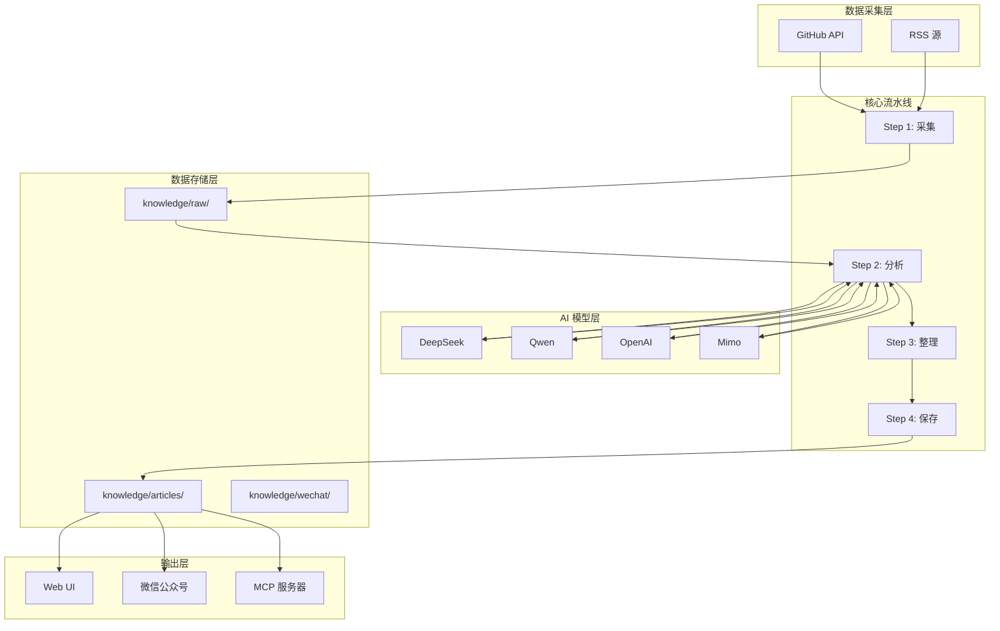

# AI 知识库助手项目 - Agents 文档

## ⚡ 快速参考

### 开始工作前必读

**加载对应 Skill**：
- 写 Python → `python-patterns`, `clean-code`
- 做 UI → `frontend-design`, `tailwind-patterns`, `ui-ux-pro-max`
- 设计 API → `api-patterns`
- 写测试 → `testing-patterns`, `tdd-workflow`
- 调试 → `systematic-debugging`
- 架构变更 → `architecture`

### 代码修改工作流（强制）

每次修改代码或脚本，必须按顺序执行：

```
1. 修改代码
2. 质量检查 → ruff check .
3. 单元测试 → pytest tests/ -v
4. 功能测试 → 启动服务验证关键路径
5. 更新文档 → 同步修改所有相关文档
```

**文档更新规则**：
- 修改了代码功能 → 更新 README.md、CHANGELOG.md
- 修改了 API → 更新 README.md、AGENTS.md
- 修改了配置 → 更新 README.md、.env.example
- 修改了依赖 → 更新 requirements.txt
- 删除无用文档 → 先确认无引用再删除

---

## 1. 项目概述

本项目是一个 AI 知识库助手，自动从 GitHub Trending 和 Hacker News 采集 AI/LLM/Agent 领域的技术动态，通过 AI 分析后结构化存储为 JSON 知识条目，并支持微信公众号等渠道分发。

## 2. 技术栈

- **编程语言**: Python 3.12+
- **AI 模型**: DeepSeek / Qwen / OpenAI / Mimo（通过 API）
- **数据采集**: httpx + GitHub API + RSS
- **数据存储**: JSON 文件
- **消息推送**: 微信公众号 API
- **网站生成**: Tailwind CSS + Alpine.js
- **定时调度**: macOS launchd / schedule 库

## 3. 编码规范

- **代码风格**: PEP 8
- **命名约定**: snake_case（变量、函数、文件），CamelCase（类）
- **文档字符串**: Google 风格 docstring（包含 Args、Returns、Raises）
- **日志记录**: 使用 `logging` 模块，禁止裸 `print()`，日志级别区分 DEBUG/INFO/WARNING/ERROR
- **类型提示**: 强制使用 Python 类型提示（type hints）
- **异常处理**: 明确捕获特定异常，避免裸 `except:`，异常信息需记录上下文
- **配置文件**: 使用 YAML 或 `.env` 文件，禁止硬编码密钥

## 4. 系统架构



## 5. 项目结构

```
WeWrite/
├── pipeline/                    # 核心流水线模块
│   ├── pipeline.py              # 四步流水线主程序（采集→分析→整理→保存）
│   ├── model_client.py          # LLM 统一调用客户端（4 家提供商）
│   ├── wechat_api.py            # 微信公众号 API + Markdown→HTML 渲染
│   ├── cover_generator.py       # 可插拔配图生成（5 种后端）
│   └── rss_sources.yaml         # RSS 数据源配置
├── web/                         # Web UI
│   ├── app.py                   # FastAPI 服务
│   ├── templates/               # HTML 模板
│   └── static/                  # 静态资源
├── knowledge/                   # 数据层
│   ├── articles/                # 结构化知识条目
│   ├── raw/                     # 原始采集数据
│   └── wechat/                  # 微信发布内容
├── scripts/                     # 辅助脚本
│   ├── publish_wechat.py        # 微信公众号一键发布
│   ├── scheduler.py             # 定时任务调度器
│   ├── sync_docs.py             # 文档同步检查
│   └── generate_knowledge_site.py # 知识库静态网站生成器
├── hooks/                       # 质量门禁
│   ├── check_quality.py         # 5 维度质量评分
│   └── validate_json.py         # JSON Schema 校验
├── tests/                       # 单元测试
├── config/                      # 配置文件
│   └── auto_publish.json        # 自动发布配置
├── .opencode/skills/            # 项目级 Skill
├── mcp_knowledge_server.py      # MCP 协议知识库服务器
├── install.sh                   # 一键安装脚本
├── start.sh                     # 启动脚本
├── Makefile                     # 常用命令集合
├── requirements.txt             # Python 依赖
├── pyproject.toml               # 项目配置
├── .env.example                 # 环境变量模板
├── AGENTS.md                    # 本文档
├── README.md                    # 项目说明
├── CHANGELOG.md                 # 更新日志
└── CONTRIBUTING.md              # 贡献指南
```

## 6. 知识条目 JSON 格式

每个知识条目存储为独立的 `.json` 文件，文件名格式为 `{uuid}.json`。

```json
{
  "id": "uuid4",
  "title": "项目/文章标题",
  "source_url": "https://...",
  "source_type": "github | rss",
  "source_metadata": {
    "stars": 1500,
    "language": "Python",
    "topics": ["llm", "agent"],
    "collected_at": "2026-05-01T07:43:57Z"
  },
  "content": "原始描述",
  "summary": "AI 生成的摘要（100-200 字）",
  "key_points": ["要点1", "要点2", "要点3"],
  "tags": ["LLM", "Agent", "Python"],
  "category": "技术动态 | 开源项目 | 行业新闻",
  "score": 8,
  "status": "analyzed",
  "analyzed": true,
  "organized": true,
  "created_at": "2026-05-01T07:53:41Z",
  "updated_at": "2026-05-01T07:53:41Z"
}
```

## 7. 流水线步骤

| 步骤 | 名称 | 功能 | 输入 | 输出 |
|------|------|------|------|------|
| Step 1 | 采集（Collect） | 从 GitHub API 和 RSS 源采集数据 | 配置的源列表 | 原始数据保存到 `knowledge/raw/` |
| Step 2 | 分析（Analyze） | 调用 LLM 生成摘要、评分、标签 | 未分析的原始数据 | 更新原始数据状态 |
| Step 3 | 整理（Organize） | 去重 + 校验 + 格式标准化 | 已分析的数据 | 标准化知识条目 |
| Step 4 | 保存（Save） | 保存到 `knowledge/articles/` | 已整理的数据 | JSON 文件 |

### 增量处理机制

- **状态标记**: 原始数据中包含 `analyzed` 和 `organized` 布尔字段
- **增量加载**: `load_raw_data()` 支持按状态过滤，只加载需要处理的数据
- **日期过滤**: 支持 `--date YYYYMMDD` 参数，只处理特定日期的数据
- **懒加载**: 支持 `limit` 参数，找到足够数据即停止

## 8. LLM 提供商

| 提供商 | 环境变量 | 默认模型 |
|--------|----------|----------|
| DeepSeek | `DEEPSEEK_API_KEY` | deepseek-chat |
| Qwen | `QWEN_API_KEY` | qwen-turbo |
| OpenAI | `OPENAI_API_KEY` | gpt-4o-mini |
| Mimo | `MIMO_API_KEY` | mimo-v2.5-pro |

切换方式：设置环境变量 `LLM_PROVIDER=deepseek|qwen|openai|mimo`

## 9. 质量保障

### validate_json.py
- 校验 JSON 结构、必填字段、ID 格式（UUID）、status 枚举
- 退出码：0=全部通过，1=存在失败

### check_quality.py
- 5 维度评分（满分 100）：
  - 摘要质量 (25): 长度 + 技术关键词
  - 技术深度 (25): 基于 score 字段
  - 格式规范 (20): 必填字段完整性
  - 标签精度 (15): 1-3 个合法标签
  - 空洞词检测 (15): 不含空洞词
- 等级：A >= 80, B >= 60, C < 60

## 10. MCP 服务器

`mcp_knowledge_server.py` 实现 MCP（Model Context Protocol）协议，让 AI 工具可以直接搜索知识库。

提供的工具：
- `search_articles(keyword, limit)`: 按关键词搜索文章
- `get_article(article_id)`: 获取文章完整内容
- `knowledge_stats()`: 获取知识库统计信息

## 11. 自动化规范

### 代码修改检查清单

每次修改代码时，必须执行以下检查：

```bash
# 1. 代码风格检查
ruff check .

# 2. 运行测试
pytest tests/ -v

# 3. 文档同步检查
python scripts/sync_docs.py

# 4. 提交前检查（如果安装了 pre-commit）
pre-commit run --all-files
```

### 文档同步要求

修改代码时，必须同步更新以下文档：

| 修改类型 | 需要更新的文档 |
|----------|---------------|
| 新增功能 | README.md, CHANGELOG.md |
| 修改 API | README.md, AGENTS.md |
| 修复 Bug | CHANGELOG.md |
| 修改配置 | README.md, .env.example |
| 新增依赖 | requirements.txt, pyproject.toml |
| 修改命令 | README.md, start.sh |

### Pre-commit 配置

项目使用 pre-commit 进行自动化检查：

```bash
# 安装
pip install pre-commit
pre-commit install

# 手动运行
pre-commit run --all-files
```

检查内容：
- 代码风格（ruff）
- 类型检查（mypy）
- 测试运行（pytest）
- 文档同步（sync_docs.py）
- 安全检查（bandit）

### CI/CD 流程

GitHub Actions 自动运行：
1. Lint 检查（ruff）
2. 测试运行（pytest）
3. 文档同步检查
4. 质量评分

### 测试覆盖率要求

- **核心模块**（pipeline/）：覆盖率 ≥ 80%
- **工具模块**（hooks/、scripts/）：覆盖率 ≥ 60%
- **Web UI**（web/）：覆盖率 ≥ 50%

```bash
# 运行测试并生成覆盖率报告
pytest tests/ --cov=pipeline --cov=hooks --cov-report=html

# 查看覆盖率报告
open htmlcov/index.html
```

### 版本管理规范

**版本号格式**：`主版本.次版本.修订号`（如 1.0.0）

| 变更类型 | 版本号变化 | 示例 |
|----------|-----------|------|
| 重大功能变更 | 主版本 +1 | 1.0.0 → 2.0.0 |
| 新增功能 | 次版本 +1 | 1.0.0 → 1.1.0 |
| Bug 修复 | 修订号 +1 | 1.0.0 → 1.0.1 |

**发布流程**：
1. 更新 CHANGELOG.md
2. 更新 pyproject.toml 中的版本号
3. 创建 Git Tag：`git tag v1.0.0`
4. 推送 Tag：`git push origin v1.0.0`

### 分支管理策略

```
main          ← 稳定版本
  ↑
develop       ← 开发分支
  ↑
feature/*     ← 功能分支
hotfix/*      ← 紧急修复
```

**规则**：
- `main`：只接受 merge，禁止直接 push
- `develop`：日常开发分支
- `feature/*`：新功能开发
- `hotfix/*`：生产环境紧急修复

## 12. Skill 使用规则（强制）

**每次进行相关工作时，必须加载对应的 Skill。**

### 工作类型与 Skill 对应表

| 工作类型 | 必须加载的 Skill | 说明 |
|----------|-----------------|------|
| **编写/修改 Python 代码** | `python-patterns`, `clean-code` | Python 最佳实践、代码规范 |
| **设计/修改 Web UI** | `frontend-design`, `tailwind-patterns`, `ui-ux-pro-max` | 前端设计、Tailwind CSS、UI/UX |
| **设计/修改 API** | `api-patterns` | RESTful API 设计规范 |
| **架构设计/重构** | `architecture` | 架构决策、模块划分 |
| **写测试** | `testing-patterns`, `tdd-workflow` | 测试模式、TDD 流程 |
| **调试问题** | `systematic-debugging` | 系统化调试方法 |
| **代码审查** | `code-review-checklist` | 代码审查清单 |
| **性能优化** | `performance-profiling` | 性能分析、优化策略 |
| **数据库设计** | `database-design` | 数据库架构、索引策略 |
| **部署发布** | `deployment-procedures` | 部署流程、回滚策略 |
| **安全审计** | `vulnerability-scanner` | 安全漏洞扫描 |

### 使用示例

```
# 修改 Python 代码前
skill python-patterns
skill clean-code

# 设计 Web UI 前
skill frontend-design
skill tailwind-patterns
skill ui-ux-pro-max

# 写测试前
skill testing-patterns
skill tdd-workflow

# 调试问题时
skill systematic-debugging
```

### 检查清单

每次提交代码前，确认是否已加载相关 Skills：

- [ ] Python 代码：已参考 `python-patterns` 和 `clean-code`
- [ ] Web UI：已参考 `frontend-design` 和 `tailwind-patterns`
- [ ] API 设计：已参考 `api-patterns`
- [ ] 测试：已参考 `testing-patterns`
- [ ] 架构变更：已参考 `architecture`

## 13. 定时调度与自动发布

### 定时调度（schedule 库）

```bash
python scripts/scheduler.py          # 启动调度器
python scripts/scheduler.py --test   # 测试模式（立即执行一次）
```

### 自动发布配置

自动发布功能可通过 Web UI 管理页面（`/admin`）进行配置：

**配置选项**：
- **启用/禁用**：开关自动发布功能
- **发布时间**：默认每天 10:00（pipeline 完成后）
- **选择策略**：按评分最高 / 按时间最新 / 随机选择
- **最低评分**：只发布评分 ≥ N 的文章
- **发布数量**：每天发布 1-3 篇

**配置文件**：`config/auto_publish.json`

```json
{
  "enabled": false,
  "publish_time": "10:00",
  "strategy": "highest_score",
  "min_score": 8,
  "publish_count": 1
}
```

## 14. 红线（绝对禁止的操作）

1. **禁止硬编码敏感信息**：API 密钥、Token、密码等必须通过环境变量或配置文件读取
2. **禁止裸 `print()`**：所有输出必须通过 `logging` 模块
3. **禁止直接写入文件而无异常处理**：必须使用 try/except 包裹 IO 操作
4. **禁止无限循环或未设置超时的网络请求**：所有网络操作必须设置 timeout
5. **禁止忽略证书验证**：HTTPS 请求必须验证证书
6. **禁止手动修改 `knowledge/articles/` 下的 JSON 文件**：所有修改必须通过流水线

## 15. 代码修改工作流（强制执行）

### 完整流程

每次修改代码或脚本时，必须按以下顺序执行：

#### Step 1: 修改代码
- 修改目标文件
- 确保代码风格符合项目规范（PEP 8、类型提示、docstring）

#### Step 2: 质量检查
```bash
ruff check . --fix
```
- 必须全部通过，无 error
- warning 可以保留（如未使用导入）

#### Step 3: 单元测试
```bash
pytest tests/ -q
```
- 必须全部通过
- 如果测试失败，先修复测试再继续

#### Step 4: Web 功能测试
```bash
# 启动服务（后台）
./start.sh web &
sleep 5

# 运行自动化 Web 测试
python scripts/test_web.py

# 关闭服务
kill %1
```
- 测试所有页面和 API 端点
- 测试失败时自动分析原因并修复

#### Step 5: 更新文档
根据修改类型，同步更新相关文档：

| 修改类型 | 需要更新的文档 |
|----------|---------------|
| 新增功能 | README.md, CHANGELOG.md |
| 修改 API | README.md, AGENTS.md |
| 修复 Bug | CHANGELOG.md |
| 修改配置 | README.md, .env.example |
| 新增依赖 | requirements.txt, pyproject.toml |
| 修改命令 | README.md, start.sh |

**⚠️ 强制检查点**：每次完成代码修改后，必须检查：
- [ ] 本次修改涉及哪些类型？（功能/API/配置/依赖/命令）
- [ ] 对应的文档是否已更新？
- [ ] CHANGELOG.md 是否记录了本次修改？

### 文档清理规则

- 删除文档前，先搜索项目中是否有引用：`grep -r "文档名" .`
- 确认无引用后才可删除
- 删除后更新所有引用该文档的地方

### 示例：修改 start.sh 后的完整流程

```bash
# 1. 修改 start.sh
vim start.sh

# 2. 质量检查（shell 脚本用 shellcheck）
shellcheck start.sh || true

# 3. 功能测试
rm -rf venv && ./start.sh web &
sleep 5
curl -s http://localhost:8000/health
kill %1

# 4. 更新文档
# - 如果修改了命令参数 → 更新 README.md
# - 如果修改了依赖检查 → 更新 AGENTS.md
# - 记录修改 → 更新 CHANGELOG.md
```

---

*最后更新：2026-05-05*
