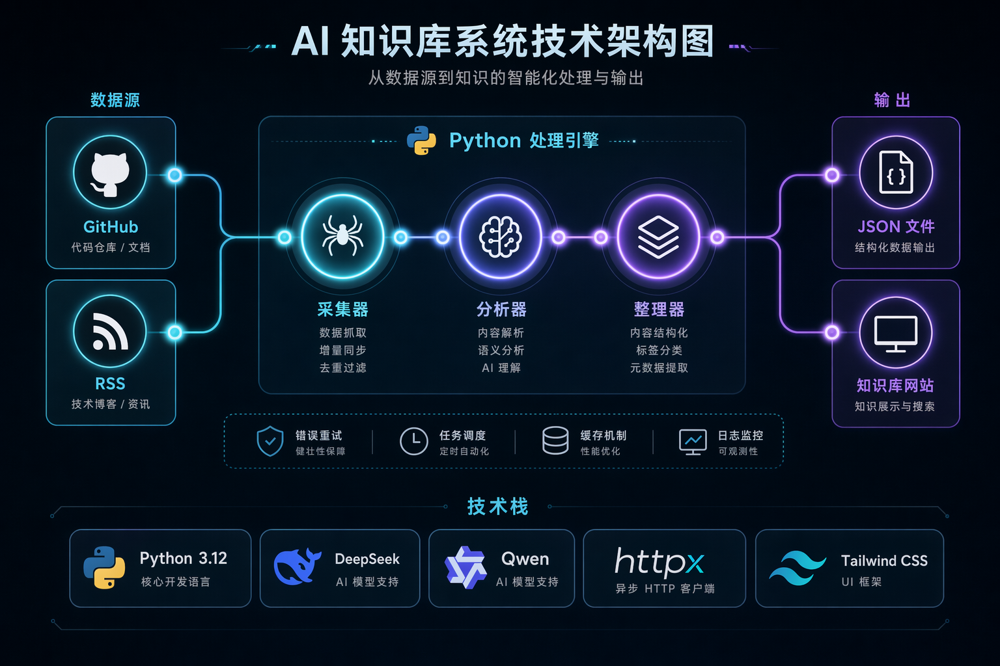

# AI 知识库助手

<p align="center">
  
</p>

<p align="center">
  <strong>自动化采集 · AI 智能分析 · 结构化存储 · 多渠道分发</strong>
</p>

<p align="center">
  <a href="#功能特性">功能特性</a> •
  <a href="#快速开始">快速开始</a> •
  <a href="#项目架构">项目架构</a> •
  <a href="#使用指南">使用指南</a> •
  <a href="#部署">部署</a>
</p>

---

## 简介

AI 知识库助手是一个端到端的技术动态追踪系统，自动从 GitHub Trending、Hacker News 等源采集 AI/LLM/Agent 领域的最新内容，通过大模型（DeepSeek/Qwen）进行智能分析，生成结构化的知识条目，并支持渠道分发。

**当前收录**: 68 篇知识条目 | 3 个分类 | 170+ 个标签

## 功能特性

| 功能                 | 说明                                                |
| -------------------- | --------------------------------------------------- |
| **智能采集**   | 支持 GitHub Search API、RSS 源，自动去重            |
| **AI 分析**    | 调用 DeepSeek/Qwen 生成摘要、提取要点、自动分类打标 |
| **结构化存储** | 每篇文章独立 JSON，包含标题/摘要/要点/标签/评分     |
| **知识展示**   | 静态网站生成，支持搜索、筛选、详情查看              |
| **定时任务**   | macOS launchd 自动调度，每日采集、每周分析          |
| **多渠道分发** | 支持微信公众号发布                                  |

## 快速开始

### 环境要求

- Python 3.12+
- API Key: DeepSeek / Qwen（用于 AI 分析）
- GitHub Token（可选，提高 API 限额）

### 安装

```bash
# 克隆项目
git clone https://github.com/yourusername/ai-knowledge-base.git
cd ai-knowledge-base

# 创建虚拟环境
python -m venv venv
source venv/bin/activate  # macOS/Linux
# venv\Scripts\activate   # Windows

# 安装依赖
pip install -r requirements.txt
```

### 配置环境变量

```bash
# .env 文件
DEEPSEEK_API_KEY=your-deepseek-key
GITHUB_TOKEN=your-github-token        # 可选
APIYI_API_KEY=your-apiyi-key          # 可选，用于图片生成
```

### 运行

```bash
# 完整流水线（采集 → 分析 → 整理 → 保存）
python pipeline/pipeline.py

# 仅采集
python pipeline/pipeline.py --step 1

# 仅分析（需要 API Key）
python pipeline/pipeline.py --step 2 --step 3 --step 4

# 按日期处理（只处理特定日期的数据）
python pipeline/pipeline.py --date 20260501

# 预览模式（不实际保存）
python pipeline/pipeline.py --dry-run
```

## 项目架构

```
ai-knowledge-base/
├── pipeline/
│   ├── pipeline.py          # 四步流水线主程序
│   ├── model_client.py      # LLM 调用客户端
│   ├── wechat_api.py        # 微信公众号 API
│   ├── cover_generator.py   # 配图生成器
│   └── rss_sources.yaml     # RSS 源配置
├── knowledge/
│   ├── raw/                 # 原始采集数据
│   └── articles/            # 结构化知识条目（68 JSON）
├── scripts/
│   ├── publish_wechat.py    # 微信公众号发布
│   ├── scheduler.py         # 定时任务调度器
│   └── generate_knowledge_site.py # 知识库网站生成器
├── hooks/
│   ├── check_quality.py     # 质量评分
│   └── validate_json.py     # JSON 校验
├── mcp_knowledge_server.py  # MCP 协议服务器
├── requirements.txt         # Python 依赖
├── .env.example             # 环境变量模板
└── logs/                    # 运行日志
```

### 工作流

```
┌─────────────┐     ┌─────────────┐     ┌─────────────┐     ┌─────────────┐
│   采集器    │ ──▶ │   分析器    │ ──▶ │   整理器    │ ──▶ │   存储      │
│  Collector  │     │  Analyzer   │     │  Organizer  │     │    Save     │
└─────────────┘     └─────────────┘     └─────────────┘     └─────────────┘
     │                    │                    │                    │
     ▼                    ▼                    ▼                    ▼
 GitHub API           DeepSeek            去重校验           JSON 文件
 RSS 源               Qwen API           格式标准化        knowledge/
```

## 知识条目格式

```json
{
  "id": "uuid",
  "title": "项目/文章标题",
  "source_url": "https://...",
  "source_type": "github | rss",
  "summary": "AI 生成的摘要",
  "key_points": ["要点1", "要点2", "要点3"],
  "tags": ["LLM", "Agent", "Python"],
  "category": "开源项目 | 技术动态 | 行业新闻",
  "score": 8,
  "status": "analyzed"
}
```

## 使用指南

### 生成知识库网站

```bash
python scripts/generate_knowledge_site.py
# 输出: site/knowledge/
# 浏览器打开: site/knowledge/index.html
```

### 定时任务（macOS）

```bash
# 加载定时任务
launchctl load ~/Library/LaunchAgents/com.kailiang.ai-kb-collect.plist
launchctl load ~/Library/LaunchAgents/com.kailiang.ai-kb-analyze.plist

# 查看状态
launchctl list | grep kailiang

# 手动触发
launchctl start com.kailiang.ai-kb-collect
```

### 查看日志

```bash
# 采集日志
tail -f logs/collect.log

# 分析日志
tail -f logs/analyze.log
```

## 配置说明

### RSS 源配置

编辑 `pipeline/rss_sources.yaml`：

```yaml
sources:
  - name: "Hacker News"
    url: "https://hnrss.org/newest?q=AI+OR+LLM+OR+agent"
    limit: 20
  - name: "AI News"
    url: "https://example.com/rss"
    limit: 10
```

### 分类定义

| 分类     | 说明                        |
| -------- | --------------------------- |
| 开源项目 | GitHub 上的 AI 相关开源项目 |
| 技术动态 | 技术文章、教程、最佳实践    |
| 行业新闻 | AI 行业新闻、产品发布、观点 |

## 技术栈

- **语言**: Python 3.12+
- **AI 模型**: DeepSeek / Qwen / OpenAI / Mimo（通过 API）
- **数据采集**: httpx + GitHub API + RSS
- **数据存储**: JSON 文件
- **网站生成**: Tailwind CSS + Alpine.js
- **定时调度**: macOS launchd / Linux systemd

## 贡献

欢迎提交 Issue 和 Pull Request！

1. Fork 本仓库
2. 创建特性分支 (`git checkout -b feature/amazing-feature`)
3. 提交更改 (`git commit -m 'Add amazing feature'`)
4. 推送到分支 (`git push origin feature/amazing-feature`)
5. 创建 Pull Request

## 迭代计划

完善多数据源类型，向情感洞察（两性情感、家庭故事、历史）、舆情监测分析、行业调研、竞品分析（例如业内理财产品对比、信用卡卡种分析）、深度研究助手、开源智选、智能体前沿洞察、趋势分析等方向，每个方向都做单独的agent

完善推送机制及自定义配置，多渠道推送（Telegram、飞书Bot等），增加Web UI界面用于管理和展示，安装网页设计skill

## 许可证

Apache License 2.0 - 详见 [LICENSE](LICENSE)

---

<p align="center">
  Made with ❤️ by <a href="https://github.com/kailiangzhang">kailiangzhang</a>
</p>

<p align="center">
  
</p>
